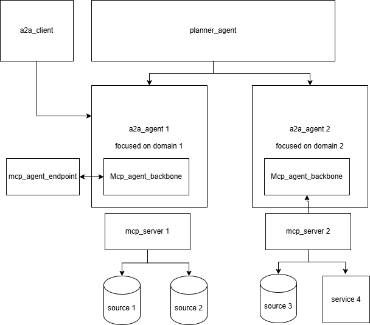

# Swarm Launcher

## Overview

The Swarm Launcher is your gateway to unleashing the power of agent swarms. This project, built upon the robust **Swarm** framework, provides a streamlined way to initiate and manage your intelligent agents. Whether you're deploying individual A2A (Agent-to-Agent) agents, integrating them with MCP (Multi-Agent Communication Protocol) capabilities, or orchestrating complex request executions with a recursive planner agent, Swarm Launcher has you covered.

## Key Features

- **A2A Agent Deployment**: Easily launch stand alone A2A agents , with or without MCP integration, to facilitate direct agent-to-agent communication.
- **Planner Agent Orchestration**: Deploy sophisticated planner agents that intelligently orchestrate and manage request execution across a swarm of A2A agents.
- **Planner Server**: Creates an A2a Agent server, that is connected to multiple agents, and orchestrate their action. It is useful for advanced, recursive planning capabilities, enabling more complex and adaptive workflows.

The diagram below illustrates dependancies between agent ( with or without mcp), and planner agents 


To make it simple you need first to launch an a2a agent ( configured with or without MCP)
Then you can launch a planner that is connected at least to one a2a agent ( also via configuration)
If you want recursivity, you then can launch an a2a planner server agent connected at least to one a2a agent. And then you can launch another one connected to any a2a agents ( a simple agent, or a planner server agent)


## Getting Started

To kickstart your agent swarm, first utilize the provided `script_execution.sh` launcher script. 
This script simplifies the process of bringing up your agents and getting them ready for action.

Once you are comfortable, you can of course build your own scripts


###  Using tutorial `script_execution.sh`

The `script_execution.sh` script is designed to be a simple, yet powerful, entry point for launching your swarm. Before running, make sure to set the necessary LLM API keys as environment variables. For example:

```bash
export LLM_A2A_API_KEY="your_a2a_api_key_here"
export LLM_MCP_API_KEY="your_mcp_api_key_here"
export LLM_PLANNER_API_KEY="your_planner_api_key_here"
```

Then build the project
```bash
cargo build --release
```

After that, we created a tutorial script to guide you in launching appropriate agents.
Just follow the prompts 
```bash
sh ./script_execution.sh 
```

###  Next Steps 

Provide a libraries of configuration scripts corresponding to real world use cases

The config files , along with a use case description will be in `use_case/use_case_x_configuration`


---
**Note**: This `README.md` provides a high-level overview. For detailed configuration and usage instructions, please refer to the specific agent configurations within the `codebase/swarm_launcher/configuration/` directory and the Swarm framework documentation.